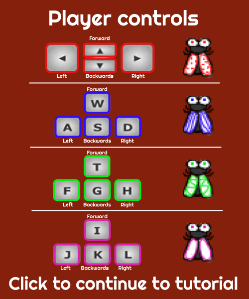

# Fly Out

A multiplayer obstacle course video game playable on itch.io. In this game, you are flies stuck in a cave trying to Fly Out! You must work together with your fellow flies, dodge obstacles, and find a way out of the cave! Press buttons to clear obstacles, collect keys to open gates, ride in elevators, and avoid webs that trap you. This game emphasizes teamwork because one player will not be able to win the game without the help of others. This game can be played by 2 to 4 players on one keyboard. Have fun!

## Links
[Link to Game](https://thucchi-cs.itch.io/fly-out)

[Video Demo](https://drive.google.com/file/d/1vjM1PQsunJwiZh5W06qxbG9HLoon3ooZ/view)

## How To Play

### Player Controls
This game allows up to 4 players on one keyboard. The controls for each player is shown below in the image. This game also uses non traditional controls. The forward keys does not necessarily move your fly up, it will move your fly forward relative to its current rotation. Similarly, the backwards key will move your fly backwards relative to your fly's rotation. The left and right keys are used to rotate your fly counter-clockwise and clockwise, respectively, not moving it left and right.

### Auto Scrolling
The screen is constantly moving up, simulating a collapsing cave. You must move quick! Don't get left behind!

### Webs
When a fly goes into cobwebs, it is trapped and cannot move. To be freed, a teammate must come near the trapped fly and hold down the space bar. Only then can the trapped fly move freely.

### Gates & Keys
Gates are placed throughout the game to block the paths of the flies. To open up a gate, you must collect a key first. Anyone can open the gate once a key is collected. Don't waste your keys!

### Buttons
Many obstacles will be in the way of the flies. Some obstacles require you to press buttons to clear the paths.

Red buttons only need to be pressed once, while green buttons will need to be held down.

### Water
You can pass through running water but it will slow your fly down!

### Elevator
Some parts will require you to move using an elevator. Flies must be completely inside the elevator for it to move. Another fly must hold down the button that moves the elevator.

## How It Was Made
The game was originally made by Thuc Chi Do ([thucchi-cs](https://github.com/thucchi-cs)), Ronin Gambill ([Ronin-the-Barbarian](https://github.com/Ronin-the-Barbarian)), and Kaidyn Haun ([KaidynH](https://github.com/KaidynH))

### Code
This game was entirely coded with Python using the Pygame library. The game was converted to be playable on itch.io using the Pygbag library.

### Assets
Some graphics were originally made by team members with Photopea and FireAlpaca.

Other royalty free graphics were found on opengameart.org and freepik.com.

Music and sound effects were either recorded by team members, or found on pixabay.com.

